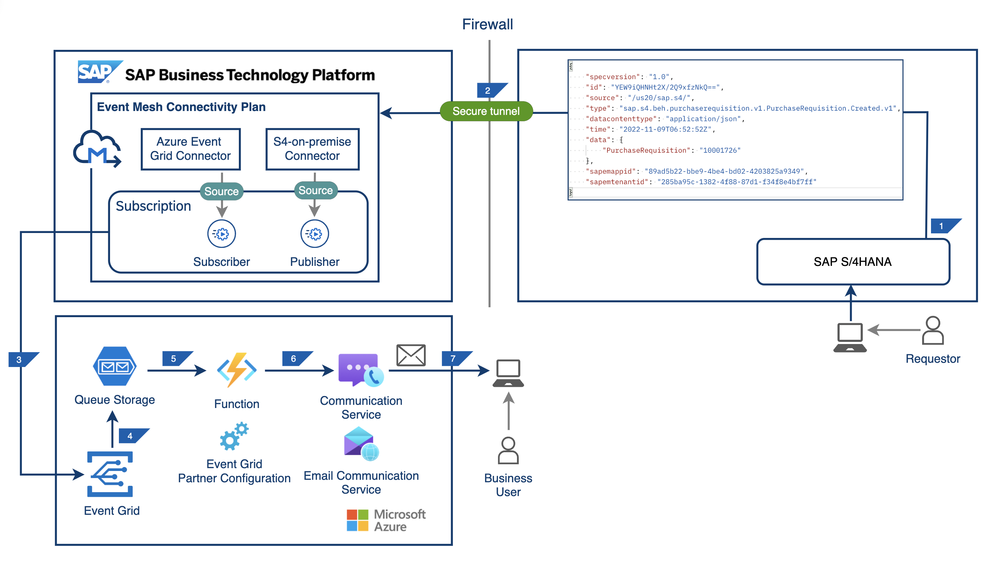

# Integrate Events Between SAP and Microsoft using SAP Event Mesh - Connectivity Bridge Service

## Description

SAP Event Mesh is a fully-managed cloud service for enabling applications, integrations and extensions to communication asynchronously through events. Events are significatnt changes in state(for example, Business Partner updated in SAP S/4HANA).

SAP Event Mesh-Connectivity Bridge service's integration with Azure Event Grid enables SAP World to send events to Microsoft Azure. In this tutorial, you will be using the Beta version of SAP Event Mesh - Connectivity Bridge service which enables direct connection between SAP BTP Event Mesh to Azure Event Grid. You can develop event driven integrations and applications using this service.

## Table of Contents
[Scenario](#scenario)\
[Solution Architecture](#solution-architecture)\
[Requirements](#requirements)\
[Implementation: Configuration and Development](#configuration-and-development)\
[Additional Resources](#additional-resources)\
[Known Issues](#known-issues)\
[Reference](#useful-links)\
[Disclaimer](#disclaimer)\
[How to Obtain Support](#how-to-obtain-support)\
[Code of Conduct](#codeofconduct)\
[Contributing](#contributing)\
[License](#license)

## Scenario

A SAP Business user creates a SAP Purchase Requisition in SAP S/4HANA which generates an event. The event gets published into a topic of SAP Event Mesh from which the event gets transported to Azure Event Grid’s partner topic. A queue bound with this partner topic (through Event Subscription) receives the event.

## Solution Architecture

1. Purchase Requisition gets created in SAP S/4HANA system. This change creates a notification event with the Purchase Requisition ID in the payload.
2. This event is sent to the SAP Event Mesh.
3. SAP Event Mesh instance with connectivity bridge service plan have two connectors (Azure Event Grid & S4-on-premise) which are configured in subscription as publisher and subscriber. This subscription pushes the event to Azure Event Grid.
4. Microsoft Azure Storage Account's queue receives the events. You can use queue storage when you have a long running process that takes too long to respond. 
5. When a new item is received in the queue, the azure function is triggered with the message in the queue as an input.
6. The Azure Function App calls the Azure communication service with queue message.
7. Azure Communication Service sends email notification to the configured business user.

## Requirements

These are the technical prerequistics for an setting up integration between SAP Event Mesh and Azure Event Grid for SAP S/4HANA event.

1.	A subaccount in SAP BTP with entitlements for Event Mesh plan “event-mesh-connectivity” - beta. Reach out to askgrid@sap.com in case you do not see this service in your subaccount.
2.	SAP S/4HANA 2020(MQTT Adapter) or SAP S/4HANA 2021+(AMQP Adapter) system to act as an event publisher.
3.	Microsoft Azure subscription. 
4.  A verified Partner Registration ID. Reach out to askgrid@sap.com in case you do not have.   
5.	Relevant service principals with RBACs and roles in Azure for provider, application, event flow.

## Configuration and Development

Follow the below steps to configure SAP S/4HANA, SAP BTP and Microsoft Azure System for the scenario. Based on the installation type of SAP S/4HANA, please follow the documentation for configurations related to connectivity in SAP BTP.

[Step 1: Set Up the Subaccount in SAP BTP](./tutorial/Step1-Configure-SAP-BTP/README.md)  
[Step 2: Configure Microsoft Azure Platform](./tutorial/Step2-Configure-Azure/README.md)   
[Step 3: Onboard Connectors in SAP BTP](./tutorial/Step3-Onboard-Connectors/README.md)  
[Step 4: Configure SAP S/4HANA](./tutorial/Step4-Configure-SAP-S4HANA/README.md)  
[Step 5: Configure Event Subscription in Microsoft Azure](./tutorial/Step5-Configure-EventSubscription-Azure/README.md)  
[Step 6: Create Microsoft Azure Function App](./tutorial/Step6-Create-Azure-function/README.md) 
[Step 7: Test Application](./tutorial/Step7-Test-Your-Application/README.md)

## Additional Resources
In this project, the Microsoft Azure function app has been implemented based on the following samples.

* [Azure Queue storage trigger for Azure Functions](https://learn.microsoft.com/en-us/azure/azure-functions/functions-bindings-storage-queue-trigger).
* [Quickstart: How to send an email using Azure Communication Service](https://learn.microsoft.com/en-us/azure/communication-services/quickstarts/email/send-email?pivots=programming-language-javascript).

## Known Issues

No known issues.

## Reference

### Event Mesh Connnectivity Bridge
* [Event Mesh Connectivity Plan Concepts (Beta)](https://help.sap.com/docs/SAP_EM/bf82e6b26456494cbdd197057c09979f/3ea50112d436473081abeca191c5560e.html).  
* [Get Started with Event Mesh Connectivity Plan (Beta)](https://help.sap.com/docs/SAP_EM/bf82e6b26456494cbdd197057c09979f/c649cd7a833e4654ace1b9928cc17a06.html).  

### Azure Event Grid

* [Azure Event Grid documentation](https://learn.microsoft.com/en-us/azure/event-grid/). 
* [Subscribe to events through portal](https://learn.microsoft.com/en-us/azure/event-grid/subscribe-through-portal). 

### Azure Functions

* [Azure Functions documentation](https://learn.microsoft.com/en-us/azure/azure-functions/).  
* [Azure Queue storage trigger for Azure Functions](https://learn.microsoft.com/en-us/azure/azure-functions/functions-bindings-storage-queue-trigger?tabs=in-process%2Cextensionv5&pivots=programming-language-csharp).  

### Azure Communication services
* [Azure Communication Services](https://learn.microsoft.com/en-us/azure/communication-services/).  
* [Prepare Email Communication resource for Azure Communication Service](https://learn.microsoft.com/en-us/azure/communication-services/concepts/email/prepare-email-communication-resource).  

## Disclaimer
This project has been a proof of concept, including several limitations and prerequisites. The objective was to build end-to-end flow with a new event connector from SAP Event Mesh to Azure Event Grid. For this reason, the implementation should not be seen as any recommendation for production. It fulfils the purpose and requirements of a proof of concept and is not intended for productive usage. It has been declared as pure proof of concept only to give the development teams ideas for solving potential challenges.

## How to obtain support
[Create an issue](https://github.tools.sap/btp-use-case-factory/Event-Mesh-Connectivity-Plan/issues) in this repository if you find a bug or have questions about the content. For additional support, [ask a question in the SAP Community.](https://answers.sap.com/questions/ask.html).

## Code of Conduct
Refer to [CODE OF CONDUCT](./CODE_OF_CONDUCT.md) file.

## Contributing
If you wish to contribute code, offer fixes or improvements, send a pull request. Due to legal reasons, contributors will be asked to accept a DCO when they create the first pull request to this project. This happens in an automated fashion during the submission process. SAP uses [the standard DCO text of the Linux Foundation.](https://developercertificate.org/)

Refer to the [CONTRIBUTING](./CONTRIBUTING.md) file for guidelines to contributions from external parties.

For additional support, [ask a question in the SAP Community.](https://answers.sap.com/questions/ask.html)

## License
Copyright (c) 2022 SAP SE or an SAP affiliate company. All rights reserved. This project is licensed under the Apache Software License, version 2.0, except as noted otherwise in the LICENSE file.