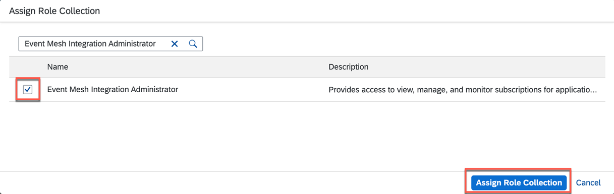

# Set Up the Subaccount in SAP BTP
In this page, you will setup the subaccount in SAP BTP for enabling SAP Event Mesh - Connectivity Bridge Service.

### 1. Subaccount readiness in SAP BTP

1. You should have a SAP BTP Enterprise Account. Refer to [Getting Started with an Enterprise Account in the Cloud Foundry Environment](https://help.sap.com/docs/BTP/65de2977205c403bbc107264b8eccf4b/56440ab2380041e092c29baf2893ef97.html).

2. Create a global account that has the entitlement to use Event Mesh. Refer to [Getting a Global Account.](https://help.sap.com/docs/BTP/65de2977205c403bbc107264b8eccf4b/d61c2819034b48e68145c45c36acba6e.html#loiod61c2819034b48e68145c45c36acba6e)

3. Create a subaccount in us20 region. Refer to [Create a Subaccount in the Cloud Foundry Environment.](https://help.sap.com/docs/BTP/65de2977205c403bbc107264b8eccf4b/05280a123d3044ae97457a25b3013918.html)

4. Create a space within the subaccount in which Cloud Foundry is enabled. Refer to [Managing Orgs and Spaces Using the Cockpit.](https://help.sap.com/docs/BTP/65de2977205c403bbc107264b8eccf4b/c4c25cc63ac845779f76202360f98694.html)

5. Check if you have the required authorizations and roles for Enterprise Event Enablement in SAP S/4HANA. Refer to [Authorization Objects and Roles.](https://help.sap.com/docs/SAP_S4HANA_ON-PREMISE/810dfd34f2cc4f39aa8d946b5204fd9c/d847fc396adb4e27b0c6577a43b0eece.html?version=2020.000)

### 2. Set Up SAP Event Mesh - Connectivity Bridge service

1.  In the SAP BTP Cockpit, navigate to your subaccount. If you aren't sure how to navigate in the SAP BTP cockpit, refer to [Navigate in the Cockpit](https://help.sap.com/docs/BTP/65de2977205c403bbc107264b8eccf4b/0874895f1f78459f9517da55a11ffebd.html).

2. Choose **Entitlements** > **Entity Assigments**  and in **Select Entities** list, choose your subaccount name.

3. Choose **Configure Entitlements**.

    

4. Choose **Add Service Plans** to see all available entitlements.

    

5. In the **Search field**, type "event mesh" and choose the entitlement for **Event Mesh**.

6. In the Service Details: Event Mesh window, choose the **event-mesh-connectivity-beta plan.**

7. Choose **Add 1 Service Plans** to add this entitlement for the Event Mesh service in your subaccount.

    

8. Chooose **Save**.
    
    

    After setting up the Event Mesh connectivity plan in the BTP cockpit, you can create an Event Mesh service instance.

### 3. Create an SAP Event Mesh Instance using the Connectivity Bridge Plan(Beta)

1. In the SAP BTP Cockpit, navigate to your subaccount and chooose **Services** > **Service MarketPlace**.

    

    Search for Event Mesh in the search menu. A list of available service plans is displayed.

2. Choose **Create**.

    

3. You will see the **New Instance or Subscription** pop up window.

    

4. In the **Plan** dropdown field, select *event-mesh-connectivity-beta*.

   In the **Runtime Environment** field, choose **Cloud Foundry**.

   Enter the name of the **space** where you want to create the instance in the **Space** dropdown field.

    > **Note:** You must have developer rights to the space or the instance creation fails with a message that you aren't authorized to perform the action.

    Give a meaningful name for **Instance Name** field and then choose **Next**.

5. As no mandatory **parameters** are required, choose **Next**.

   

6. Review the information and then choose **Create**.

   

    An instance of SAP Event Mesh is created and ready to use.
    

### 4. Assign Roles to Users

The service provides standard roles for typical user profiles. You can configure application roles and then assign users to these roles using the SAP BTP cockpit.
Determine the roles or role collections to assign to your users.
For more information on roles, refer to User Roles for Event Mesh.

1. In the SAP BTP cockpit, navigate to your subaccount and choose **Security > Users**. Select the user. The **Role Collections** table opens up in the right pane.

    

2. In the **Role Collections** section, choose the **three dots** that represent the options menu and then choose **Assign Role Collection**.

    

3. Choose the **Event Mesh Integration Administrator** and choose **Assign Role Collection**.

    

4. Verify that the role collection appears in the list for your user.

    

Once you have role permissions assigned to your user, you can access the Event Mesh Application.

### 5. Subscribe to the SAP Event Mesh Application

When you subscribe to the Event Mesh standard application plan in SAP BTP cockpit, a link to the Event Mesh application is enabled.

1. in the SAP BTP cockpit, navigate to your subaccount and choose **Instances and Subscriptions** and choose **Create**.

    

2. Scroll through the **Service list** and choose **Event Mesh** in the **Service** dropdown field and **standard** in the **Plan** dropdown field.

    

3. Choose **Create**.

4. The application **Event Mesh** appears in the **Subscription** tab.

> **Note:** If you try to access the application before roles are assigned to your user, then caching issues can prevent access. To resolve this issue, refer to Guided AnswersInformation published on SAP site.

Users with permissions can access the application link and log in to the Event Mesh user interface.

