# Configure Microsoft Azure Platform

## Prerequisites

You have an Microsoft Azure subscription or a free account. Refer to [Sign Up for Microsoft Azure](https://azure.microsoft.com/).

### 1. Create Azure Resource Group
In this section, you will create Azure Resource group.

1. Log in to [Microsoft Azure portal.](https://portal.azure.com/) and navigate to **Resource groups** and then choose **Create**.
    
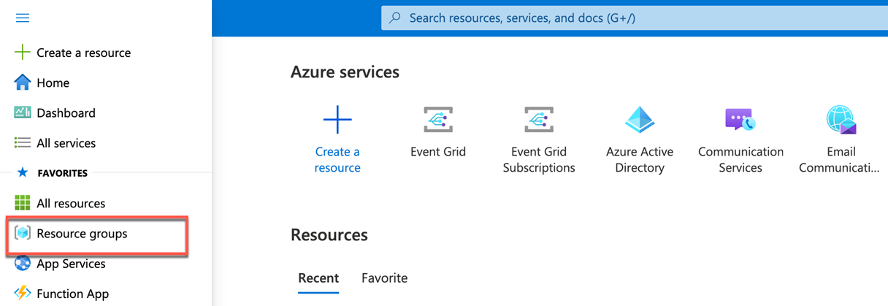

    
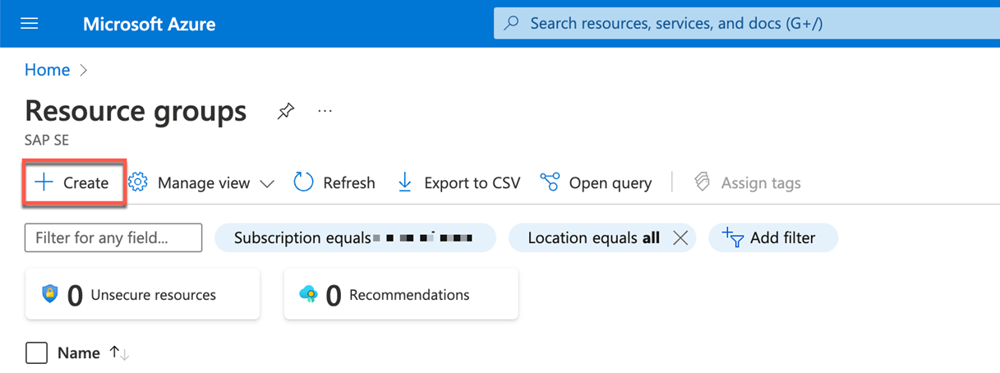

2. In the **Basics** tab, 
    - In the **Project details** section, in the **Subscription** field, select your Microsoft Azure subscription and in the **Resource group** field, enter name of your choice. 
    - In the **Resource details** section, in the **Region** field, select your Azure location.
    
    
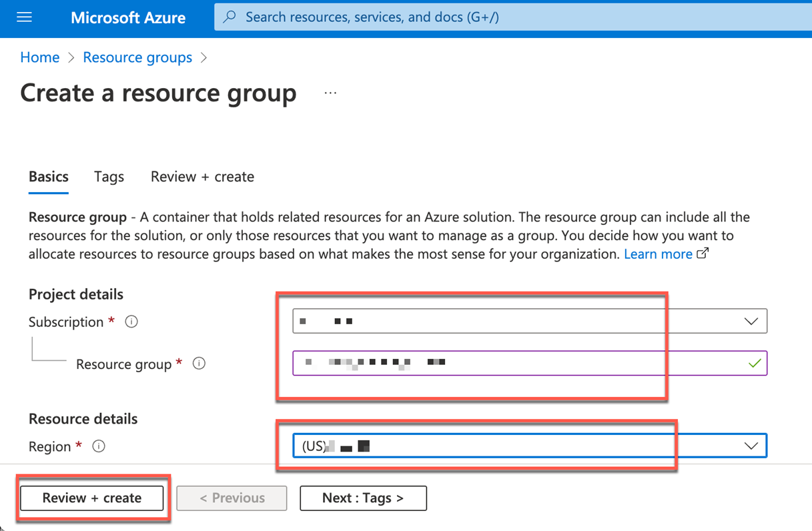

3. Choose **Review + create**. You will see **Validation passed**, post this choose **Create**. It takes a few seconds to create a resource group.

    
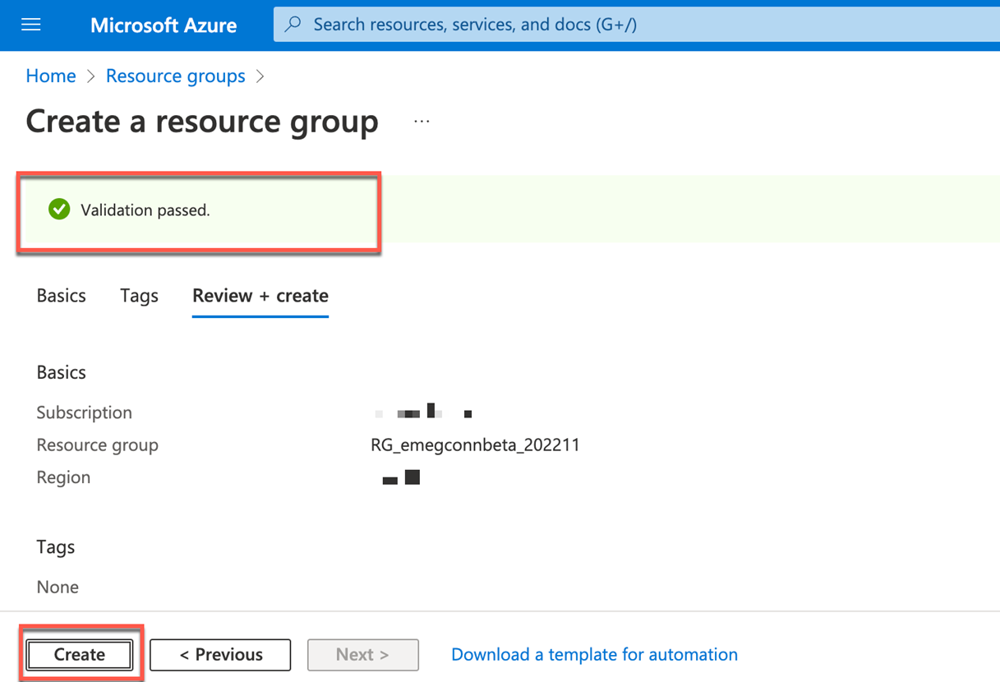

4. Choose **Refresh**  to refresh the resource group list, and then select the newly created resource group to open it. 

    
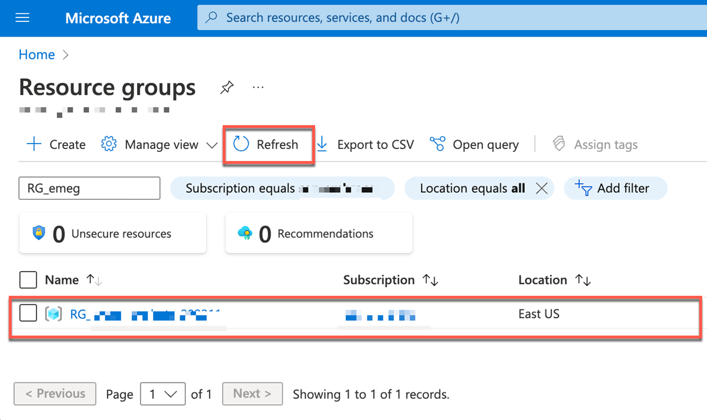

### 2. Create the Storage Account
In this section, you will create Azure storage account to save all the events that is received in Azure Event Grid.

1. Select the newly created resource group and choose **Create**. 
    
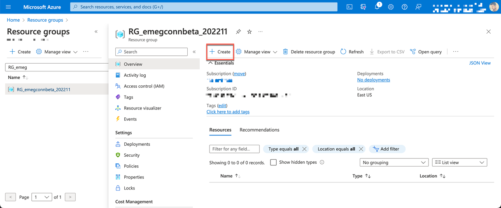

2. Search for **Storage account** and select the **Storage account** Microsoft Azure service.
    
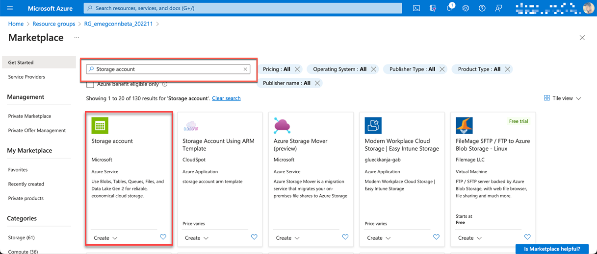

3. Select your plan in the **Plan** dropdown field and then choose **Create**.
    
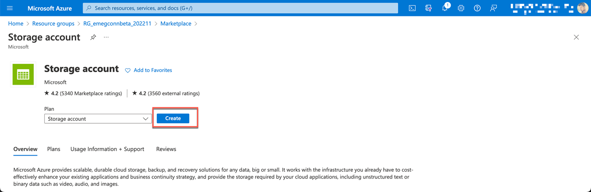

4. In the **Basics** tab, enter the following values for each setting as shown in the screenshot.
    
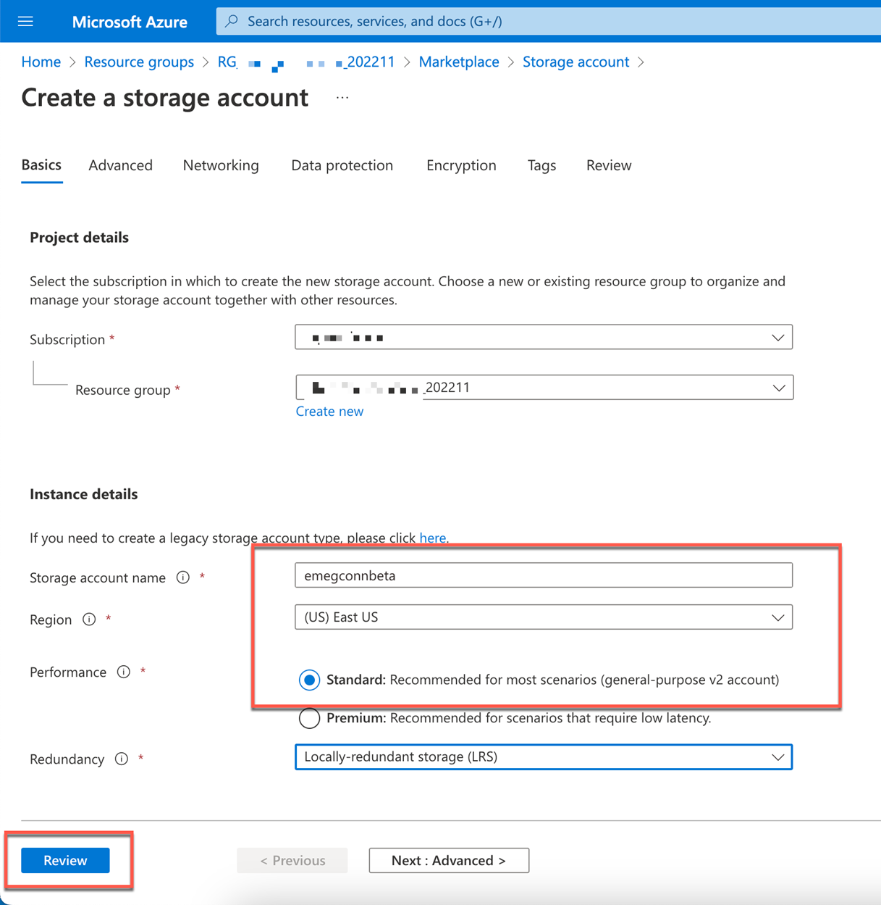

5. Choose **Review + create** to validate your selected options and to ensure all the required fields are selected.
        
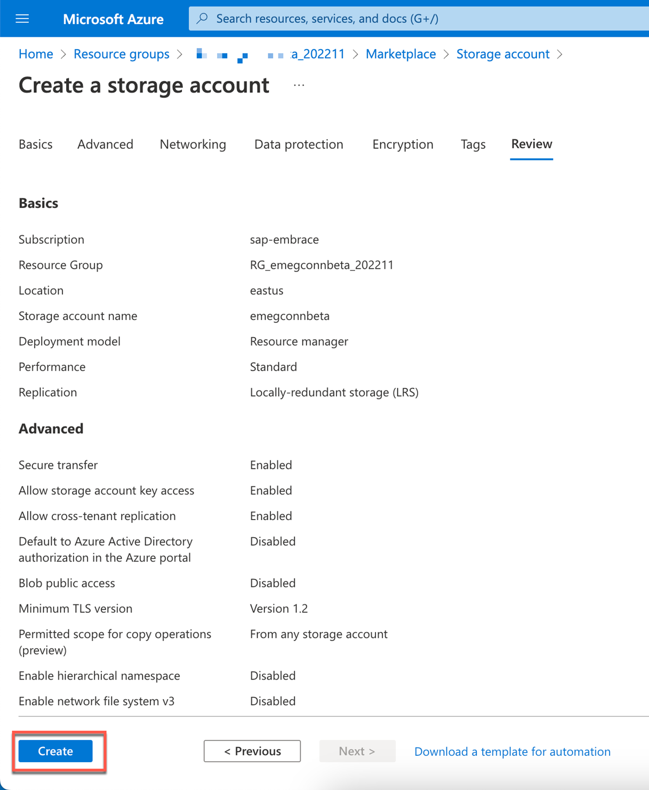

6. When validation passes successfully, choose **Create** to create and deploy the storage account.
    
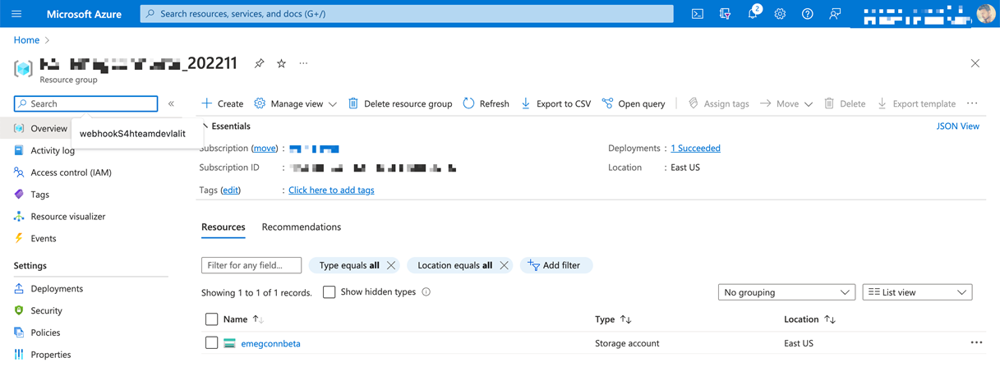

7. Once the deployment is complete, go to resource to view essential details about your new storage account.
    

### 3. Event Grid Partner Configuration 

In this section, you will create the Event Grid partner configuration and add partner authorization using partner registration ID and authorization expiration time. 

1. Select the created resource group again and choose **Create**. 
    

2. Search for **Event Grid Partner Configuration** and then choose the **Event Grid Partner Configuration** Microsoft Azure service tile.
    
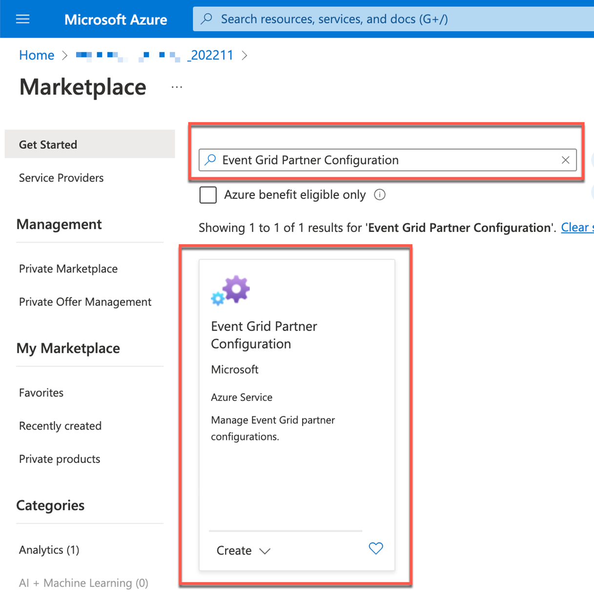

3. Choose **Create**.
    
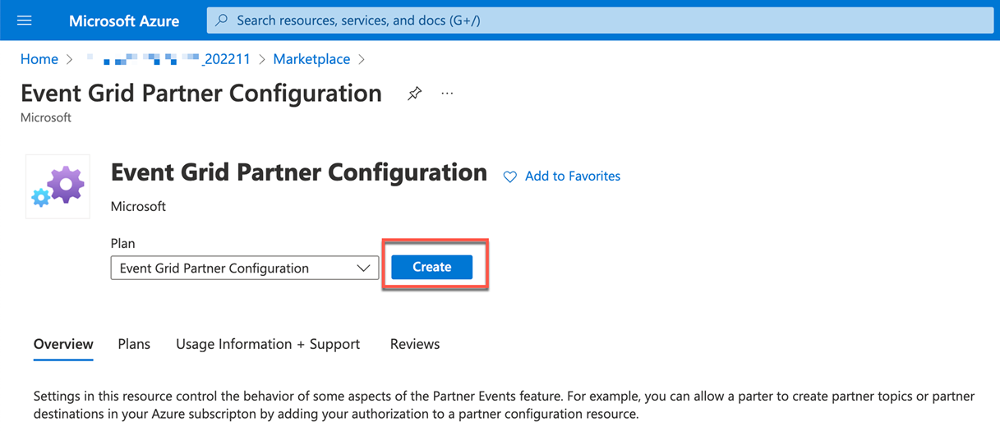

4. In the **Project Details** section, select your subscription in the **Subscription** dropdown field and select the created resource group in the **Resource group** dropdown field.

    
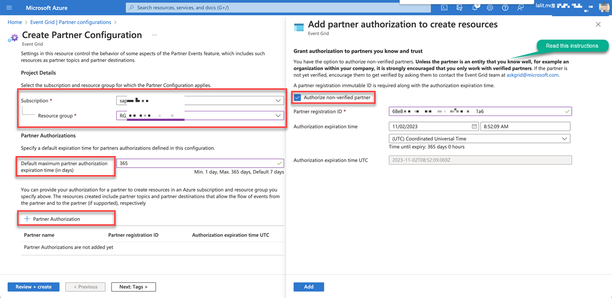

5. In the **Partner Authorization** section, enter the value **365** for **Default maximum partner authorization expiration time**.

6. Choose **+Partner Authorization** to add partner authorization to create resources. Select the **Authorize non-verified partner** checkbox.

    **Note**: You will need to get the registration ID from <UMA>

    - In the **Partner registration ID** field, enter the value of the registration id and select the date range for **Authorization expiration time**.

    - Choose **Add**.   

5. Choose **Review + create** to validate your options and to ensure all the required fields are selected. If there are issues, this tab will identify them so you can correct them.
    
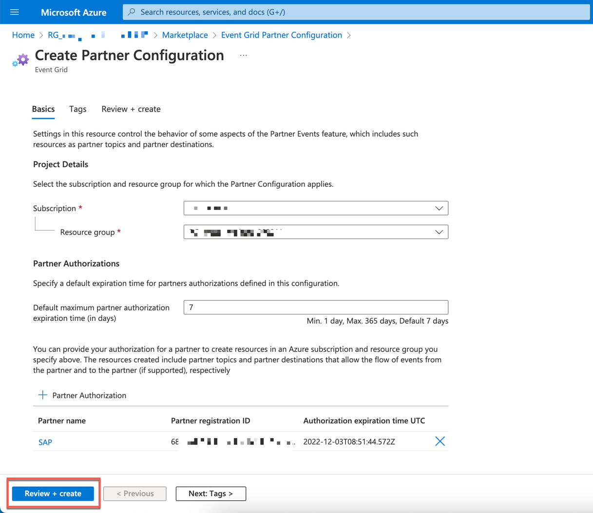

6. When validation passes successfully, choose **Create**.
    
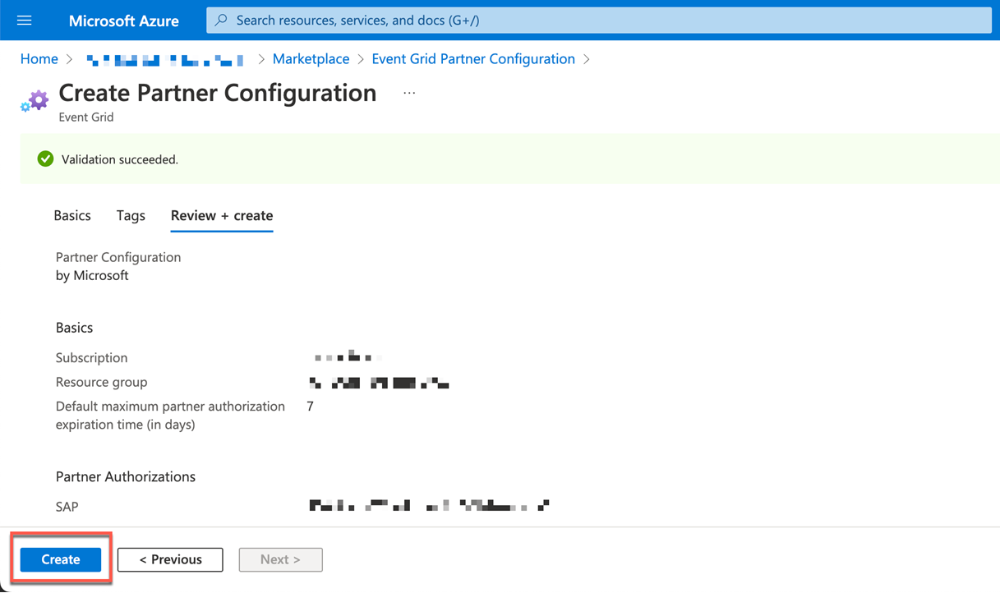

### 4. Copy the required values

Copy the value of the **Subscription** and **Subscription ID** field of the group you created. Also, copy the name of the **Storage account** resource you created. These value will be used later in the next step. 

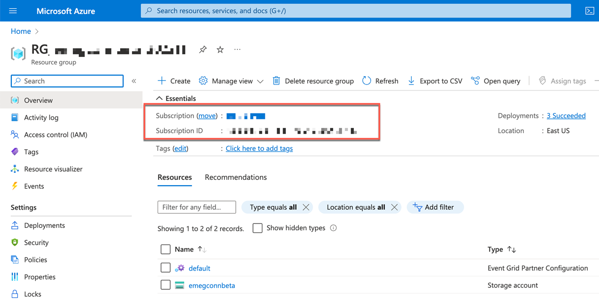

