## Onboard Connectors in SAP BTP

To realize the advantages of integration between SAP Event Mesh and Azure Event Grid, you need to create a connector. The connector establishes the integration and identifies the direction that SAP and Microsoft events can flow.

### Prerequisites

1. Configured SAP BTP Account and subaccount with Event Mesh Instance and UI Application as mentioned in [Step 1](../Step1-Configure-SAP-BTP/README.md) 
2. Configured Azure account as mentioned in [Step 2](../Step2-Configure-Azure/README.md)

### 1. Onboard Microsoft Azure Connector

1. In the [SAP BTP cockpit](https://cockpit.sap.hana.ondemand.com/cockpit/), navigate to your subaccount and chooose **Services > Instances and Subscriptions**. In the **Subscriptions** tab, choose the **Event Mesh** to open the application.

    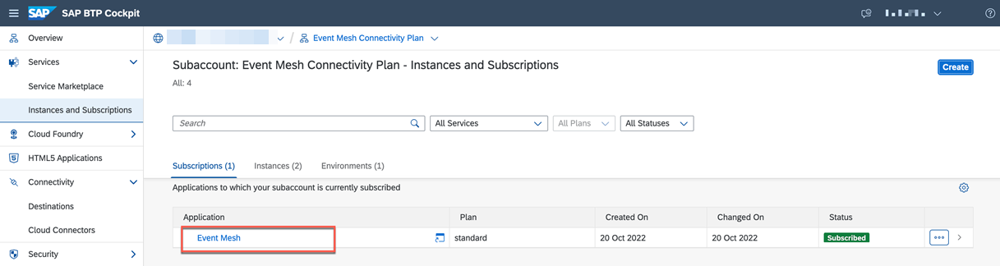

2. Choose **Connectors (Beta)**.<p>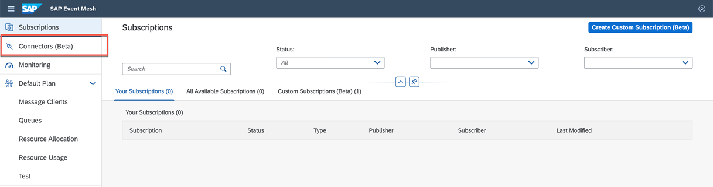</p>

3. Choose **Create Connector**. The **Create Connector** panel is displayed. <p>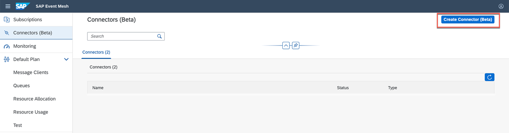</p>

4. In the **Type** dropdown menu, choose **Azure Event Grid** as the value and then choose **Next**. <p>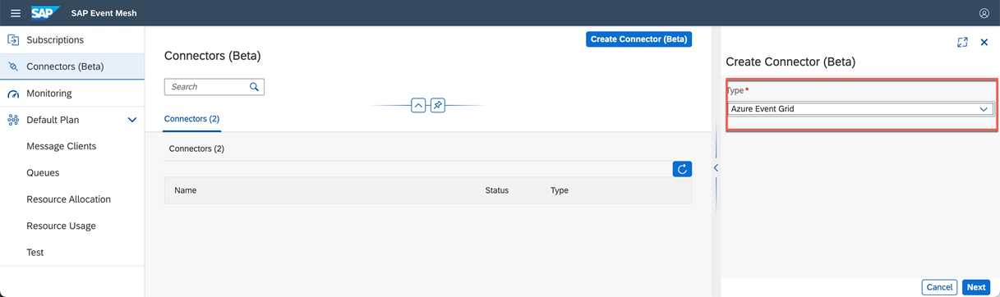</p>

5. Add the connector details.

* **Name:** Add a meaningful name for the connector that helps you identify it. There is a 1:1 relationship between Event Mesh and a connector.
* **Azure Resource Group:** Identify the resource group in Azure where events from Event Mesh will be available for consumption.
* **Azure Subscription ID:** Identify the pool of resources in Azure that you want to connect to Event Mesh.
* If events flow from Event Mesh to Azure Event Grid, identify the Partner Topic in Azure where events should be queued.

6. Choose **Save**.

    <p>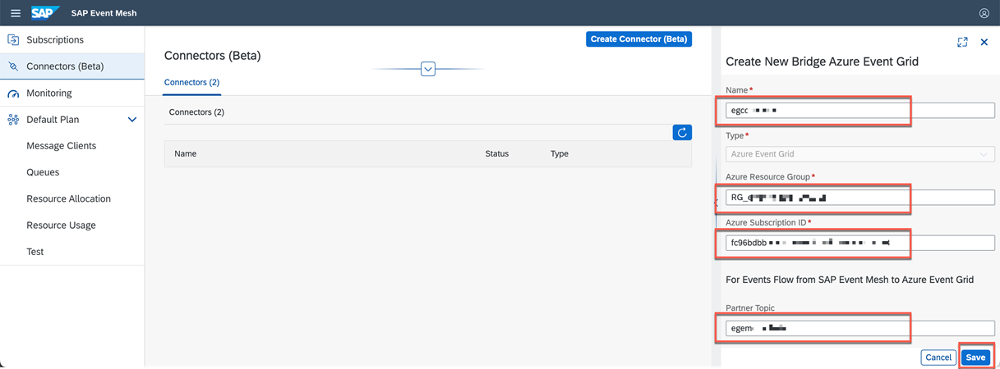</p>

    The connector is saved and appears on the Connector page. 
    
### 2. Onboard SAP S/4HANA On-Premise Connector

1.  Choose **Create Connectors**. The **Create Connector** panel displays. Now select the **SAP S/4HANA On-Premise** type and then Next.
    <p>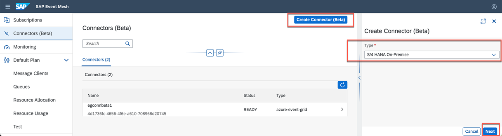</p>


2. Add the connector details:

    **Name :** Enter a meaningful name as the value for the connector that helps you identify it. There's a 1:1 relationship between Event Mesh and a connector.  
    **ce-sources:** List the SAP S/4HANA source application that publishes events and has a ce-source that is unique across the entire region.  

    **Example**

    > /<>/sap.s4/{the logical system id}

3. Choose **Save**.

    <p>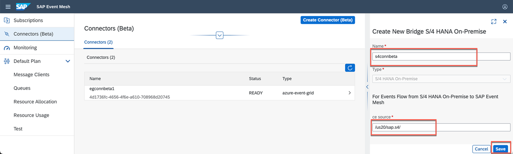</p>

    The connector is saved and appears on the Connector page.
    <p>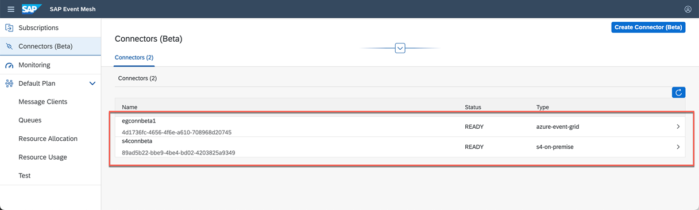</p>

### 3. Create Custom Subscription

1. Choose **Subscriptions** and then choose **Custom Subscription Plan** tab.

    <p>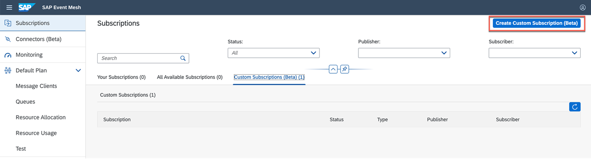</p>

2. Choose **Create New Custom Subscription** and add the details.

* **Subscription Name:** Add a meaningful name that helps you identify the connector that is associated to the subscription.
* **Publisher:** Select the connector that identifies your publishing application.
* **Publisher Source:** Select the ce-source of the publishing application associated to the connector.
* **Subscriber:** Select the connector that identifies your subscribing application.

3. Choose **Save**.
  
    <p>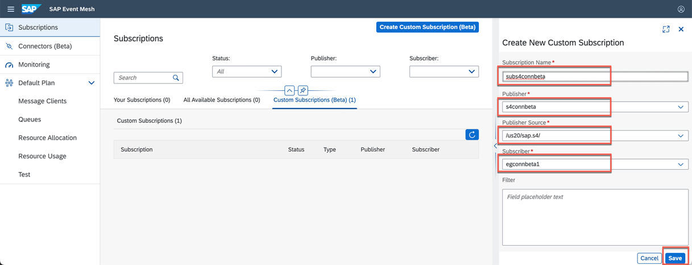</p>


    The subscription displays in the Custom Subscriptions tab and events can flow between the publishing and subscribing applications.

    <p>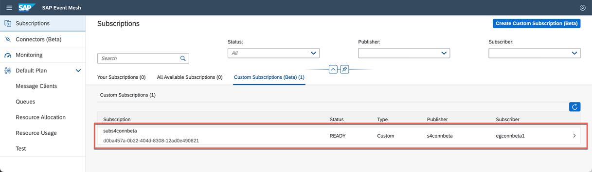</p>


### 4. Create Service Key

Get credentials for publishing to event mesh for S4 On-prem

 1. In the [SAP BTP cockpit](https://cockpit.sap.hana.ondemand.com/cockpit/), navigate to your subaccount and choose **Services** > **Instances**.

 2. Choose the **Event Mesh Service instance** to view the details.

 3. Choose **Service Keys** tab and then choose **Create**.

    <p>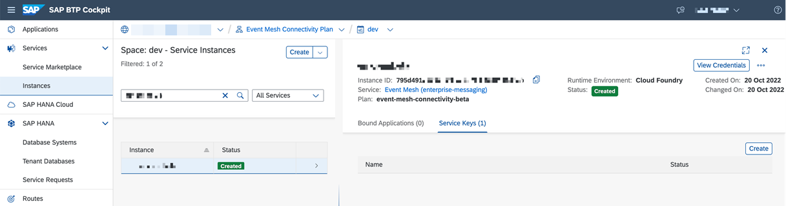</p>

 6.	In the New Service Key wizard, enter a name of your choice for **Service Key Name** field and for the  **Configure Binding Parameters** field, copy the below value.  

    ``` 
    {
      “compatibility”: true,
      “applicationID”: {app-id-of-s4-on-prem-onboarded-in-step-7}
    }
    ```
 7. Choose **Create**.

    <p>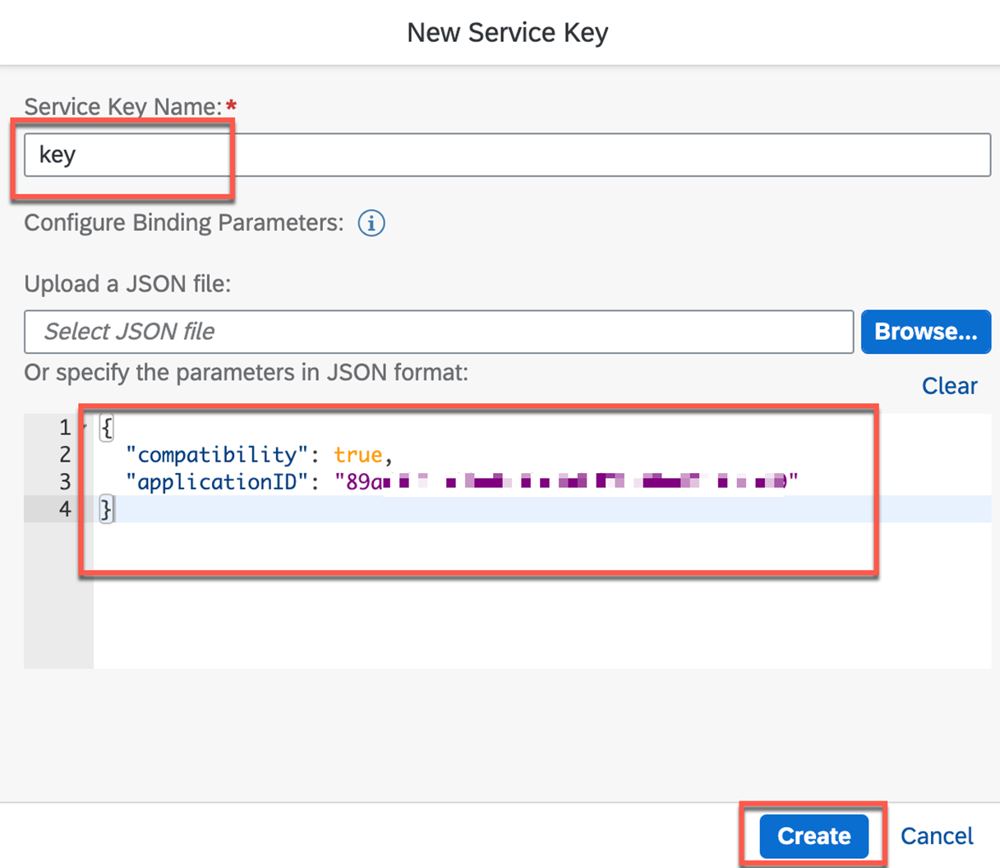</p>

 8. The generated service key will be used to create a channel in the SAP S/4HANA. To download the service key, choose **Download** (Save JSON to file). This will be used in SAP S/4HANA configuration.

    <p>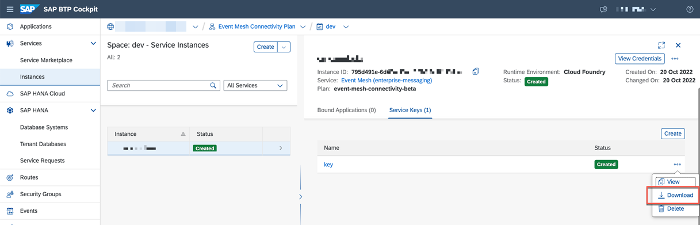</p>

    The service key contains the API URL and the credentials under the property uaa (under url) that allows you to obtain a JWT token, with the help of which you can access the event mesh service instance.

