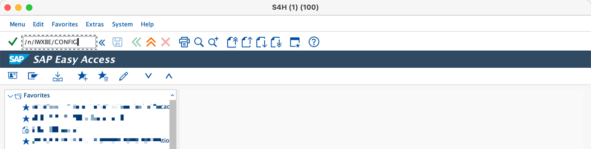
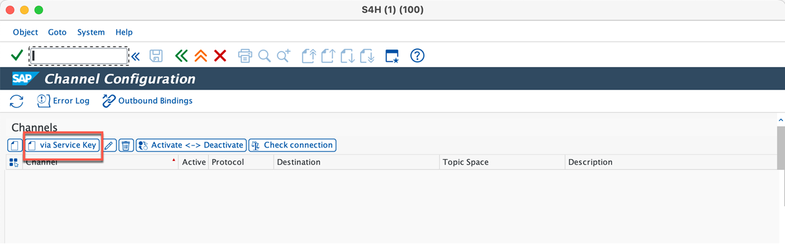
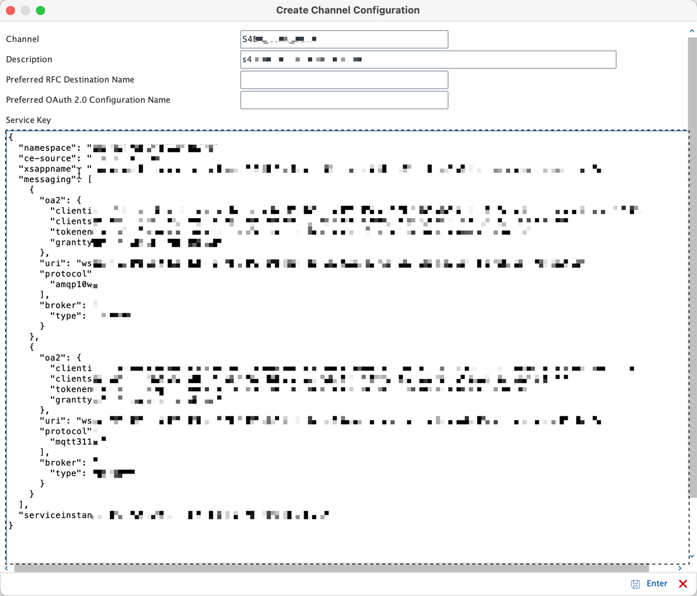
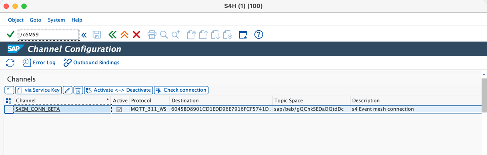
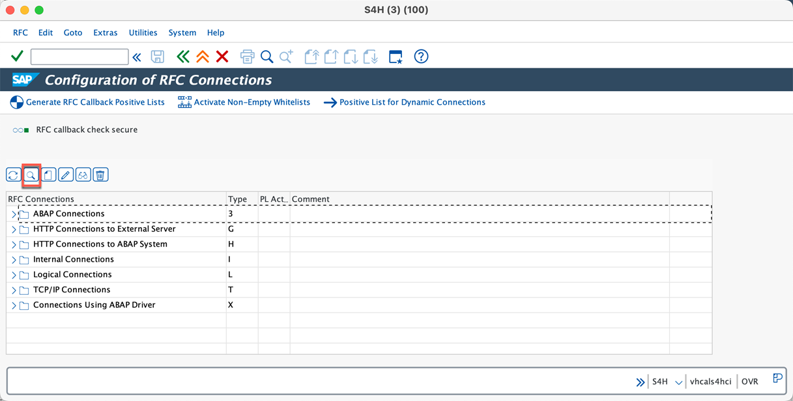
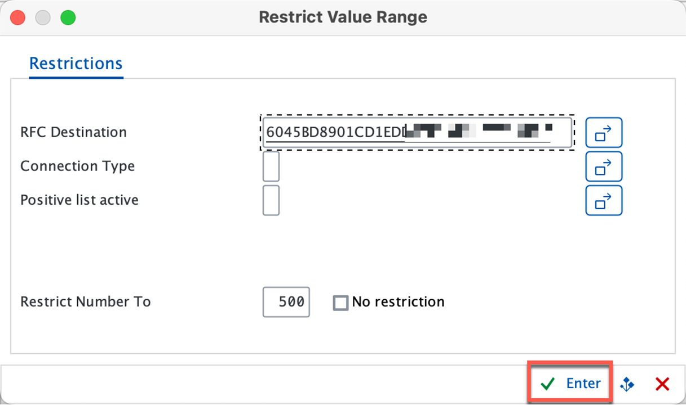
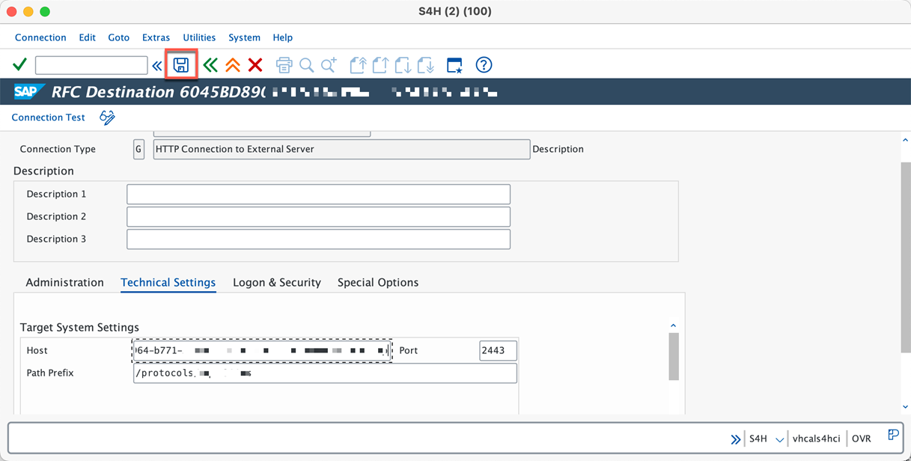
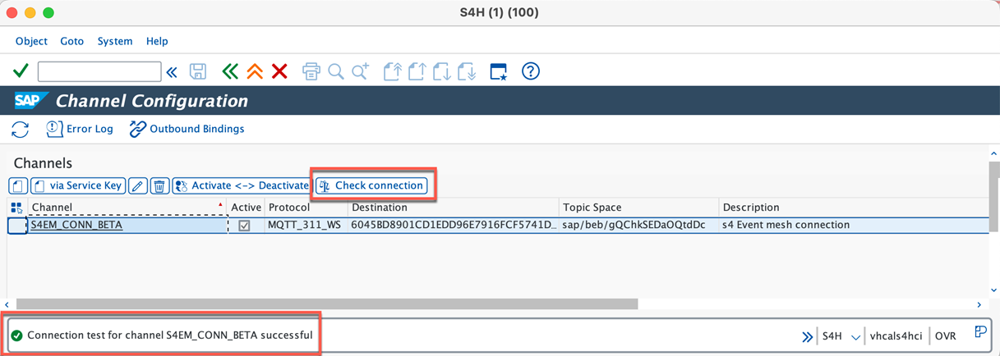
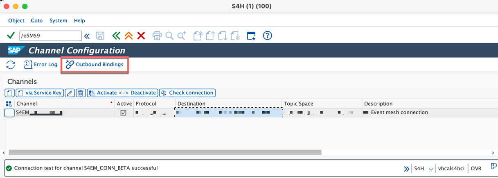
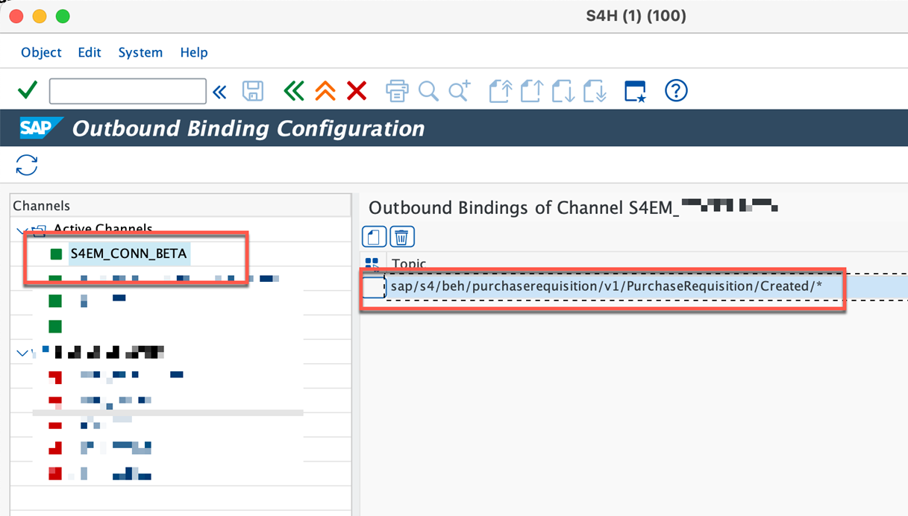

## Configure SAP S/4HANA

In this tutorial, as a SAP S/4HANA administrator you will create a channel where SAP S/4HANA business objects pass events to SAP Event Mesh.

The version of SAP S/4HANA system in this tutorial in SAP S/4HANA 2020. Refer to [Create Channel in SAP S/4HANA20202](https://help.sap.com/docs/SAP_EM/aed036b16919439baee3ca379cad1112/73f8d261e984427bbb5c2ea35b97bf55.html?state=DRAFT&version=Dev).

### 1. Create a channel

1. In your SAP S/4HANA system, open the **/n/IWXBE/CONFIG** transaction.
    

2. In **Channel Configuration**, choose **via Service Key** to create a channel.
    

3. Add a name and description of your choice in the **Channel** and **Description** field.

4. Open the downloaded service key file n step 4 of from **Step3-Onboard-Connectors** tutorial page and copy the file content. Paste this content in the **Service Key** field.

    

5. Choose **Enter** to create the channel. Copy the value in the **Destination** column. 

      

### 2. Edit the RFC Destination

1. Open **SM59** transaction in your SAP S/4HANA system.

2. Choose **Search** with the RFC destination of the channel which you copied in the previous step.

    

3. Open the RFC Destination in edit mode.
    

4. In the **Technical Settings** tab, make the following adjustment:

    - **SAP S/4HANA systems from 2020**: remove **:2443** from the host url and add **2443** in the port text box.
    - **SAP S/4HANA systems from 2021**: remove **:443** from the host url and add **443** in the port text box.

5. Choose **Save**.

    

### 3. Activate Channel and Add Outbound Bindings

1. Open **/n/IWXBE/CONFIG** transaction and select the created **channel**. 

2. **Activate** the channel and perform a **Check Connection** to verify that both activation and connection are successful.

    

3. Select the **channel** and click **Outbound Bindings**.

    

4. Add the required business object to associate with SAP Event Mesh.
    

In this case, select **sap/s4/beh/purchaserequisition/v1/purchaserequisition/Created/***, this will ensure that any operation performed on the purchase requisition object is published to SAP Event Mesh.

### Next Step
[Configure Event Subscription in Microsoft Azure](../Step5-Configure-EventSubscription-Azure/README.md)