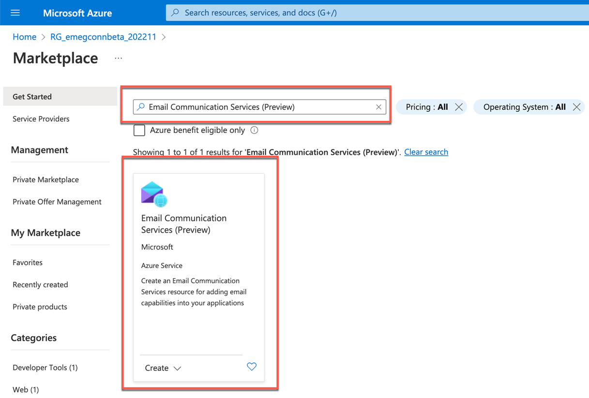

## Configure Event Subscription in Microsoft Azure

### Prerequisites

You have Microsoft Azure Subscription to receive events from SAP Event Mesh Connectivity Bridge service.

### 1. Create Event Subscription

1. Sign in to the [Microsoft Azure Portal](https://portal.azure.com/).

2. Go to your **Resource Group** and search for Event Grid Partner Topic (the one which you created in **Step3-Onboard-Connectors**) and choose to activate.
    

3. Choose **+ Event Subscription** to create a new event subscription.
    

4. In the **Basics** tab, enter the following details:

    - In the **Event Subscription Details** section, enter a name of your choice for the **Name** field and for the **Event Schema** dropdown, choose **Cloud Event Schema v1.0**.

    - In the **Topic Details** section, the **Source Resource** is auto populated with the topic resource.

    - In the **Endpoint Details** section, for the **Endpoint Types** field, select **Storage Queues** and choose **Select an endpoint**.
   
    

5.  In the **Queues** popup, 

    - In the **Subscription** dropdown field, select your Azure subscription.
    In the **Storage account** dropdown menu, select the created storage account.
    - In the **Queue name** field, enter a value of your choice.  

6. Choose **Create** to create a Queue.

    

7. Choose **Create** to create a subscription. 
    

    When deployment is complete, which may take sometime, Go to **Event subscriptions** to check the newly created event subscription as shown in the screenshot.

    

### 2. Create Email Communication Service Instance

1. Navigate to the **Resource Group**. Choose **Create** 
    

2. Search for **Email Communication Services** and choose **Email Communication Services** tile and choose **Create**.

    

3. In the **Basics** tab, 

    - In the Subscription dropdown menu, select your Azure Subscription.
    - In the Resource group dropdown menu, select the resource group you created.
    - In the **Name** field, enter a name of your choice.
    - In the **Region** field, enter **Global** as value and in the **Data location** dropdown field, choose **United States**.

4. Choose **Review + create.**

    

4. Choose **Create**.

    

5. Wait for the Deployment to complete. Choose **Go to Resource**.

    

6. In **Overview**, choose **1-click add** from **Add a free Azure subdomain** section. 

    

7. Wait for the deployment to complete.

    

8. After domain creation is completed, you'll see a list view with the created domain.

    

### 3. Create Communication Service Instance

1. Navigate to the **Resource Group** and then choose **Create** to start creating an communication service instance. 
    
2. Search for **Communication Services** and choose **Communication Services** tile and choose **Create**.

    

3. In the **Project Details** section, select your subscription and resource group. Enter a name of your choice in the **Resource Name** field and select your region in the **Data location** dropdown field. Choose **Review + Create**.

    

    

6. Choose **Domain** and then choose **Connect domain**.

    

7. Select a one of the verified domains by filtering

    * **Subscription** select the **Azure Subscription**.
    * **Resource Group** select the your **Resource Group**. 
    * **Email Service** select email service created in Step 2.
    * **Verified Domain** select the **verified Domain**

8. From the **Preview** section, copy the value of the **From** field. This email address will be used later as sender.

9. Choose **Connect**.

    

10. Ensure that the email communication service's **Status** is **Connected**. 

    

11. Connection strings allow communication services SDKs to connect and authenticate to Microsoft Azure. Choose **Keys** to view the connection string details. Copy the value of the **Connection string**, this will be used later in Azure Function App.

    

