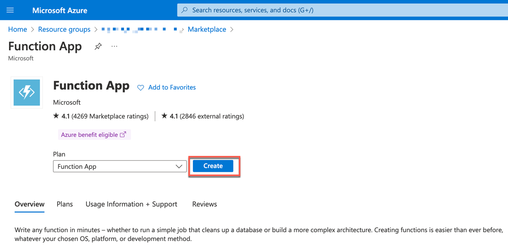
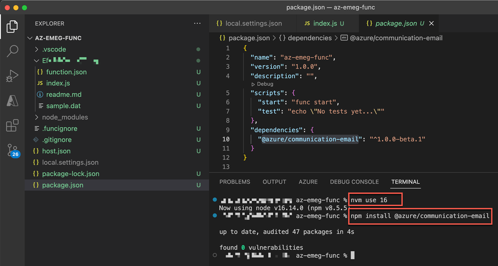
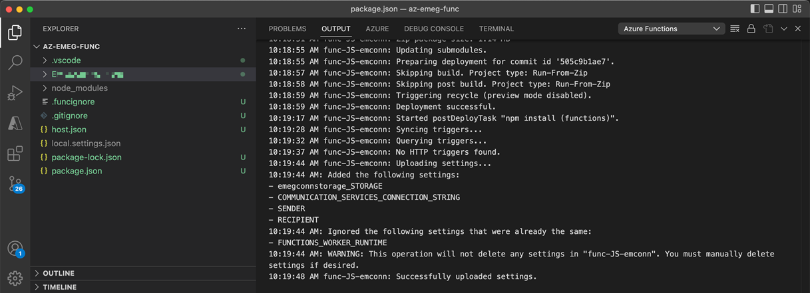

## Create Azure function Application to process events from Azure Event Grid

Use Visual Studio Code to create a JavaScript function.

### Prerequisites
1. An Azure account with an active subscription. [Create an account for free](https://azure.microsoft.com/en-gb/free/?ref=microsoft.com&utm_source=microsoft.com&utm_medium=docs&utm_campaign=visualstudio).
2. [Node.js 16.x](https://nodejs.org/en/download/releases/) or [Node.js 18.x (preview)](https://nodejs.org/en/download/releases/). Use the node --version command to check your version.
3. [Visual Studio Code](https://code.visualstudio.com/) on one of the [supported platforms.](https://code.visualstudio.com/docs/supporting/requirements#_platforms)
4. The[ Azure Functions extension](https://marketplace.visualstudio.com/items?itemName=ms-azuretools.vscode-azurefunctions) for Visual Studio Code.
5. [Azure Functions Core Tools 4.x.](https://learn.microsoft.com/en-us/azure/azure-functions/functions-run-local?tabs=v4%2Cmacos%2Ccsharp%2Cportal%2Cbash#install-the-azure-functions-core-tools)


### 1. Create Azure Function App

1. Login to Microsoft Azure Portal and choose **Resource group**.

2. Choose **Create**. 
    <p></p>

3. Enter **Function App** in the  **Search the Marketplace** input and choose **Function App**.
    <p></p>

4. Choose **Create**.
    
    <p></p>

5. In the **Basics** tab,

    - In the **Subscription** dropdown field, select your Azure subscription.
    - In the **Resource Group** dropdown field, select the name of the resource group you have created.
    - In the **Function App name** field, enter a name of your choice.
    - In the **Publish** field, select **Code** as option.
    - In the **Runtime stack** dropdown menu, choose **Node.js** and select **16LTS** in the **Version** dropdown menu.
    - In the **Region** dropdown field, select your region.  Refer [Azure geographies](https://azure.microsoft.com/en-gb/explore/global-infrastructure/geographies/) that's near you or near other services that your functions can access.

6. Choose **Next : Hosting**.

    <p></p>

7. In the **Hosting** tab, choose the storage account you created for the **Storage account** dropdown menu. 

    <p></p>

8. Choose **Review + create** to review the app configuration selections.<p></p>

9. In the **Review + create** tab, review your settings and then choose **Create** to provision and deploy the function app.

    <p></p>

    After the **Notifications** icon in the upper-right corner of the portal indicated **Deployment succeeded**, choose **Go to resource** to view your new function app.

### 2. Create your local project

1. In your Visual Studio, choose **Azure** icon in the Activity bar.

    <p></p>

2. Choose **Create Function**.

    <p></p>

3. When prompted, choose **Create new project**. Choose the **directory location** for your project workspace and choose **Select**.
    <p></p>

4. Provide the following information at the prompts:

    * **Select a language for your function project :** Choose **JavaScript**.
    * **Select a template for your project's first function :** Choose **Azure Queue Storage trigger**
    * **Provide a function name :** Enter a name of your choice.
    * **Select Setting from local.setting.json :** Choose Create new local app setting.
    * **Select subscription :** Choose Azure subscription.
    * **Name the queue from which the message will be read :** Enter the Query Name which you have already created in your Resource Group.    

    Using this information, Visual Studio Code generates an **Azure Functions** project with an **Azure Queue Storage trigger**. You can view the local project files in the Explorer.

    <p></p>

5. Update **index.js** and add the below code.

    ```
    const { EmailClient } = require("@azure/communication-email");
    const connectionString = process.env.COMMUNICATION_SERVICES_CONNECTION_STRING;

    module.exports = async function (context, myQueueItem) {
        const prId = myQueueItem.data.PurchaseRequisition;
        context.log('Purchase Requisition :'+ prId);
        const client = new EmailClient(connectionString);

        const emailMessage = {
            sender: process.env.SENDER,
            content: {
                subject: `S4Hana System Notification`,
                plainText: `Purchase Requisition ${prId} has been Created.`,
            },
            recipients: {
                to: [
                {
                    email: process.env.RECIPIENT,
                },
                ],
            },
            };

            var response = await client.send(emailMessage);
            context.log(response);
    };
    ```

    <p></p>

6. Open the **local.settings.json** file. In this file, you need to update and update the values for **COMMUNICATION_SERVICES_CONNECTION_STRING**, **SENDER** and **RECIPIENT** from the communication service instance created in the resource group.

    - For updating the **SENDER** parameter, open the communication service instance and choose **Domains** > **Domain name**.

        <p></p>

        <p></p>

        From the **Azure Managed Domain**, copy the value of  **MailFrom** and update this value for **SENDER** parameter in **local.settings.json** file. For **RECIPIENT** parameter, enter an email address of your choice.

        <p></p>   

    - For updating the **COMMUNICATION_SERVICES_CONNECTION_STRING** parameter, choose **Keys** and copy the value of **Connection String**.

        <p></p>   

    Your **local.settings.json** file should look below screenshot.
    <p></p>

7. Install requied node package.

    ```
    npm install @azure/communication-email
    ``` 
    <p></p>

### 3. Deploy Azure Function App to Microsoft Azure

1. Choose **Azure** in the Activity bar and in the Workspace area, select your **project folder** and choose **Deploy** button.

    <p></p>

2. Select **Subscription**.

    <p></p>

3. Select a **Resource**.

    <p></p>

4. After deployment completes, choose **Upload settings**.
    
    <p></p>

5. Choose **View Output** to view the creation and deployment results.

    <p></p>

    Output shows deployment and settings uploads is successfull.
    
    <p></p>
