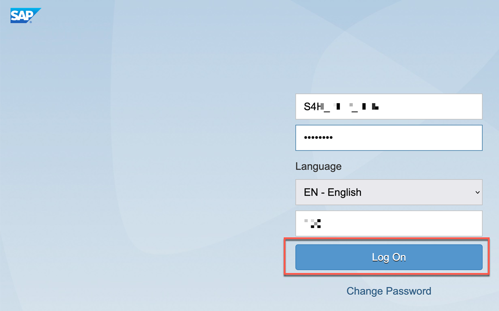
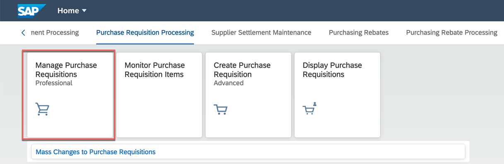
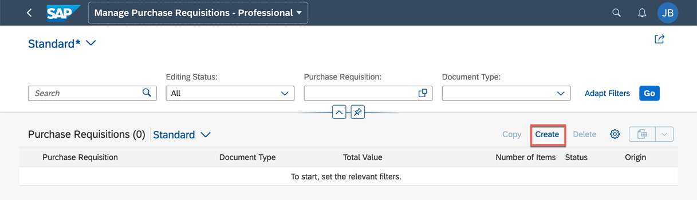
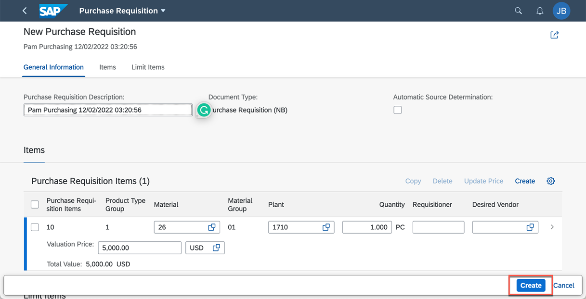
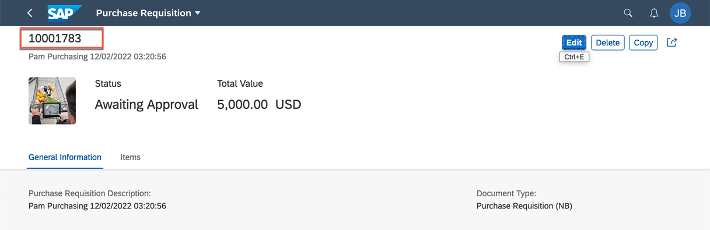
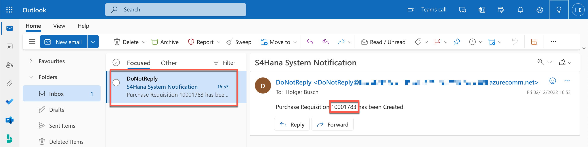

## Test Your Application

### 1. Create Event Subscription

1. Log in to your SAP S/4HANA as the business user and create a Purchase Requisition.   
    
    

2. Choose **Manage Purchase Requisitions**.
    
    

3. Choose **Create** to create Purchase Requisition.

    

4. Enter all the required information and choose **Create**.

    

    Purchase Requisition is created.
    
    

    This purchase requisition event from SAP S/4HANA is published to SAP Event Mesh and then to Azure Event Grid. With the integration setup and deployment of the Azure function, you will receive email notification as shown below.

    

Congratulations! You have completed the end-to-end event based integration SAP S/4HANA.